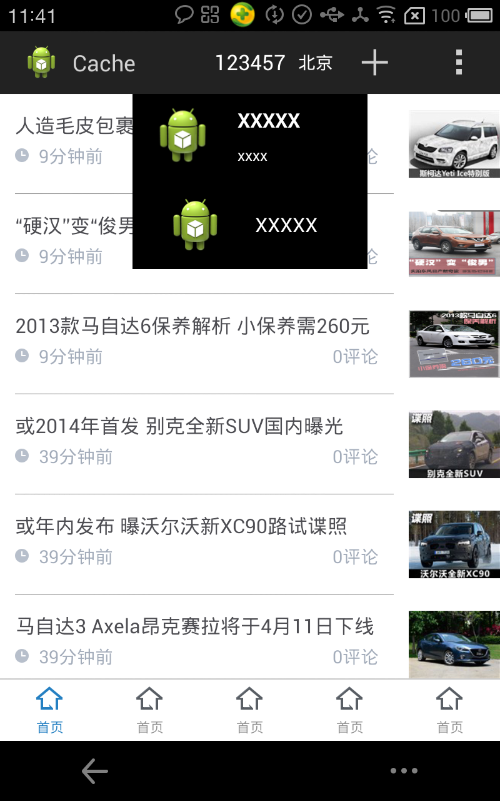
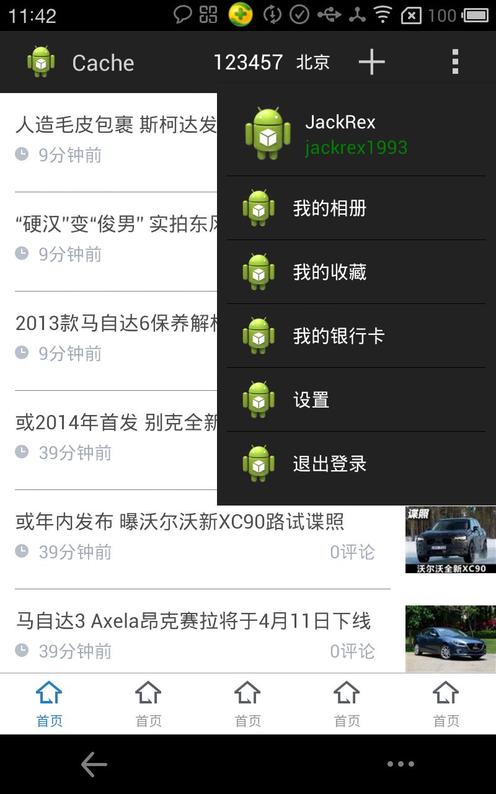

AndroidCacheFoundation
======================

AndroidCacheFoundation

### Function
This is a Base Library for android http request via Google Volley and easy Cache them.

### Intro
Provides Volley Base GET & POST Method and transform them by using GOOGLE GSON. It's very easy to use this
Foundation Parse JSON  to entity and Cache them , You just care about the app work request network via VolleyHttpClient get post
method etc. All Cache will done.(include pics). We cache picture by using ImageLoader, which you should not worry about that,the foundation
has already provide that.

### USE Extra Libs

If you are using android studio and with gradle works well,you won't care about this, all this done by android studio.

OtherWise ,if you are using eclispe or other.this CacheFoundataion use these extras libs:

1. Volley    http request & cache
2. ViewPagerIndicator   show Tabs
3. XListView  show pull to refresh and load more
4. universal image loader (UIL) cache image
5. umeng sdk to analy your user data
6. roboguice to make your application more easy and clear. use @InjectView
7. Gson googel gson to parse json more easy and quick

###More

The Foundation also provide common UI like pull to refresh ,lovely toast ,base activity with swipeback and useful utility Class.
this help you easy and quick to build a app.
ddd
### The DEMO

Demo provide Tab + ViewPager Style.

###Pics

Pic1

- - - 

Pic2

- - - 

Pic3

- - - 

Pic4
